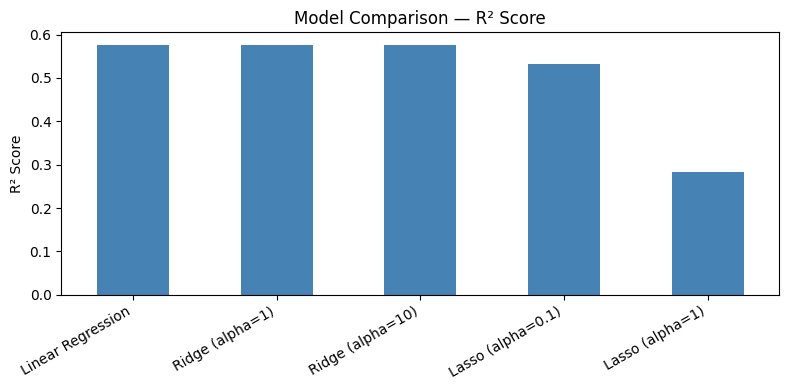

# 🏡 California Housing Price Prediction

Predicting median house prices in California using the California Housing dataset.
Compared Linear Regression, Ridge, and Lasso models.

## 📊 Results

| Model | R² Score | MAE | RMSE |
|---|---|---|---|
| Linear Regression | 0.57 | ... | ... |
| Ridge (α=1) | ... | ... | ... |
| Lasso (α=0.1) | ... | ... | ... |

Best model: **Ridge (α=1)** with R² = ...

## 🔍 What I explored
- Exploratory Data Analysis (correlation heatmap, distributions)
- Feature engineering
- Model comparison: Linear Regression vs Ridge vs Lasso
- Interactive prediction cell

## 🛠️ Tech Stack
Python | scikit-learn | Pandas | Matplotlib | NumPy

## 📁 How to Run
1. Open `housing_prediction.ipynb` in Google Colab
2. Run all cells
3. Use the prediction cell at the bottom to test custom inputs

## 📈 Model Comparison

